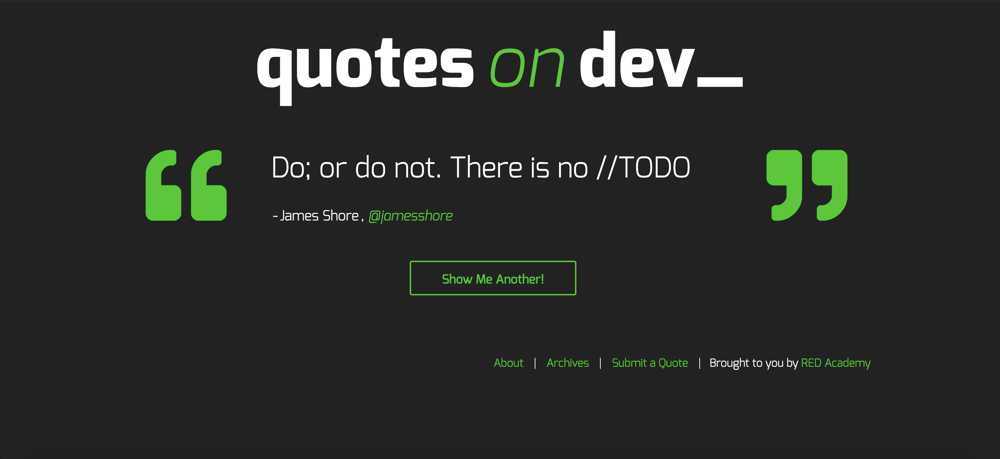
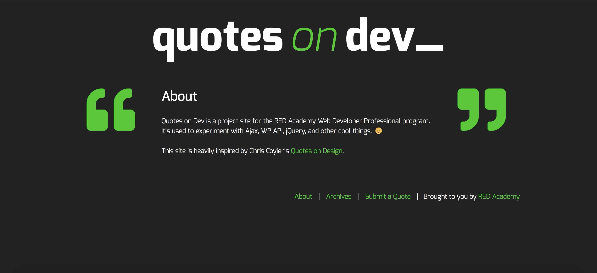
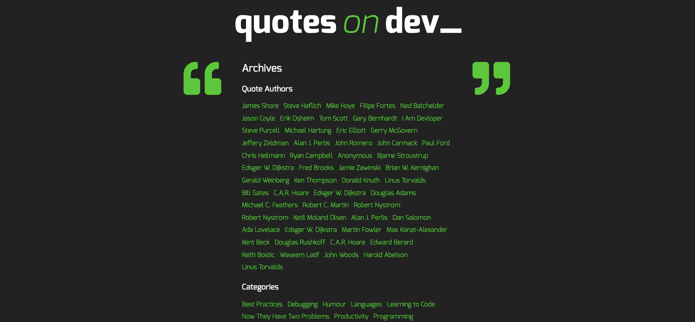
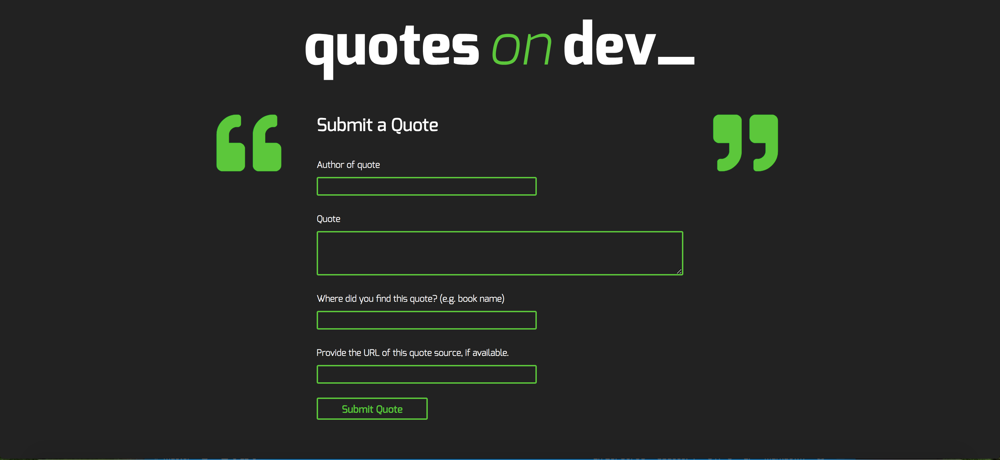

# Quotes on Dev

## Description
Quotes on Dev is a multi-page website which presents quotes from the development world and accepts the submission of new ones. The site uses Wordpress and based on the underscores theme.

## Technologies Used 

* php
* Wordpress
* JavaScript
* Jquery
* HTML5
* CSS3 and Sass 
* Gulp
* Use of GIT and GitHub.

## Personal learnings
* Use of jQuery's "ajax" method to fetch data using the WP REST API both with a GET request (for adding a new quote to the          front page) and a POST request (for submitting a new quote to the site.)
* Using WordPress as a content management system (CMS).
* Using php functions to request data from php pages.
* Use of JavaScript for showing error/success messages when a quote is submitted.
* Implementation of a mobile-first, responsive layout (optimized for three required screen sizes: mobile, tablet and desktop).
 
## Installation

1. Download repository and then add it to your `wp-content` directory.

2. Run `npm install`.

3. Run `gulp`.

